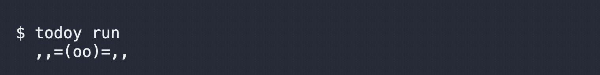
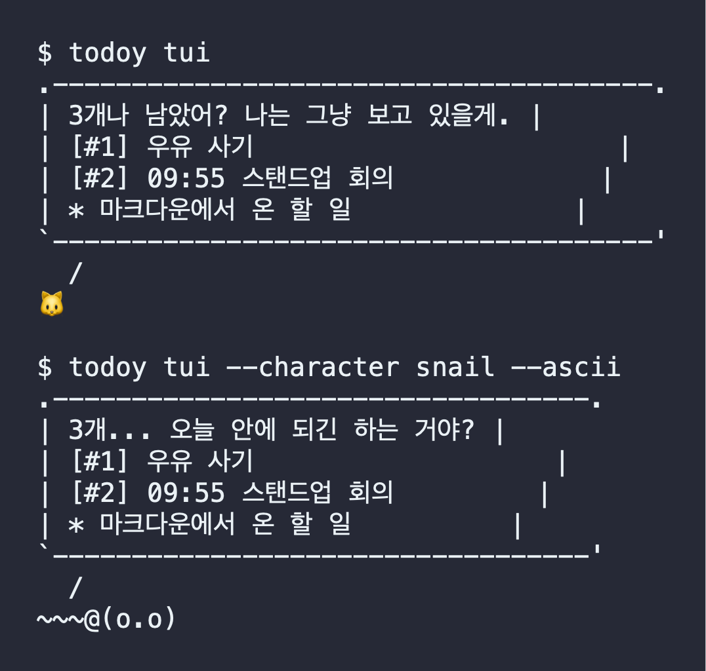
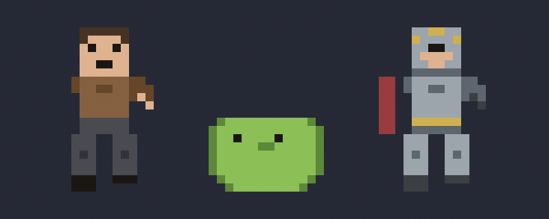
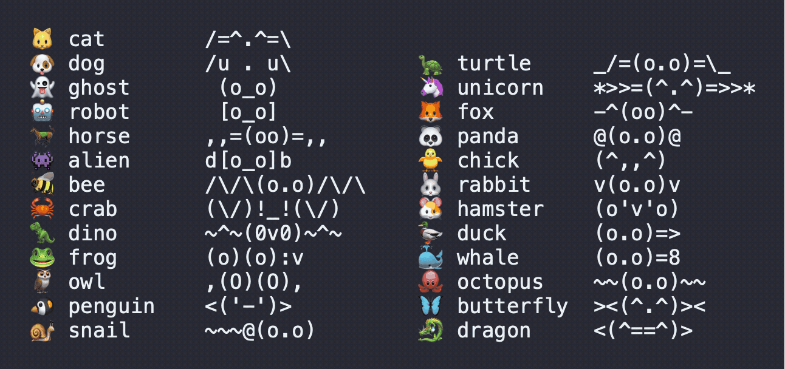
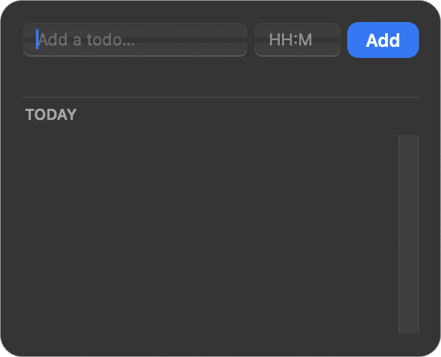

# todoy

> 한국어 버전: [README.ko.md](README.ko.md)

A character that reminds you of today's todos — in your terminal and on your desktop.

**Status: WIP.** M1 (core CLI), M2 (markdown/Obsidian source + `todoy init`),
M3 (`todoy tui`), M4 (`todoy overlay`, macOS), and M5 (release prep: CI, PyPI
packaging, docs) are done — see the [roadmap](docs/requirements.md#milestones).
No version has been published to PyPI yet; install from source for now (below).

## Demo

The desktop overlay, actually running — a horse galloping along the screen
bottom, carrying today's todos on a flag (frames self-rendered from the live
app's real windows):


`todoy run` — the horse gallops through your terminal (works on Linux,
Windows, and macOS; plain `\r` redraw, no ANSI):



The TUI, real output (default cat, and the snail in `--ascii` mode):



See [docs/demo.md](docs/demo.md) for how recordings are made.

## Install (from source, for now)

Requires Python 3.11+.

```console
$ git clone https://github.com/maengyo/todoy.git
$ cd todoy
$ uv sync            # or: pip install -e .
$ uv run todoy list  # or: todoy list (inside the venv)
```

PyPI packaging is wired up (`pipx install todoy` / `uv tool install todoy` —
see [`.github/workflows/release.yml`](.github/workflows/release.yml)), but no
version has been published yet, so install from source until the first
tagged release lands.

## What works today

A stdlib-only todo CLI backed by a local JSON file, plus todos pulled from your notes:

```console
$ todoy add "buy milk"
Added #1: buy milk

$ todoy list
  1. buy milk

$ todoy done 1
Done #1: buy milk

$ todoy list --all
  1. [x] buy milk
```

Todos live in `~/.local/share/todoy/todos.json` (honors `XDG_DATA_HOME`;
override the file entirely with the `TODOY_DATA_FILE` environment variable).

More management: `todoy rm <id>` deletes, `todoy pin <id>` / `unpin <id>` pins
(pinned todos show a 📌 and survive the daily sweep), `todoy add --pin` pins on
creation. Set `daily_clear = true` under `[general]` in the config and every
non-pinned todo from previous days is swept away on first use each morning —
the list starts fresh daily, pinned tasks stay.

### Time alarms

Give a todo a time and the overlay pops that message — and only that message —
right on time:

```console
$ todoy add "standup meeting" --at 9:55
Added #3: standup meeting

$ todoy list
  3. 09:55 standup meeting
```

Markdown notes work too: `- [ ] 14:00 회의` fires at 14:00. Alarms fire once
per day per todo (snooze re-arms them), independent of the periodic reminder.

### Pull todos from your notes (Obsidian-friendly)

Run `todoy init` and point todoy at any folder of markdown files — an Obsidian
vault works as-is. Notes edited today, plus the notes you pin, contribute their
`- [ ] task` / `- task` lines to `todoy list` (checked-off `- [x]` lines are
skipped):

```console
$ todoy init
Enable markdown source? [y/N] y
Notes folder path: ~/notes
Pinned notes (comma-separated, optional): Todo.md
Reminder interval in minutes [30]:
Config written to ~/.config/todoy/config.toml

$ todoy list
  1. buy milk
  - prepare the meeting
  - call the bank
```

### The character in your terminal, live (`todoy run`) — every OS

```console
$ todoy run --character horse
```

A long-running marquee: the character gallops left-to-right across one
terminal line carrying the one-line flag message, legs animating through a
real gait cycle with stride-locked movement (no sliding). Interval reminders
and time alarms print as blocks above and the run resumes. Works in any
terminal — Linux, Windows, macOS — with zero dependencies and no ANSI codes.
`--fps`, `--lang`, `--ascii`, `--interval` as usual; Ctrl+C to stop.

### Meet the character (`todoy tui`)

A character delivers today's todos in a speech bubble — with a gentle dose of taunting:

```console
$ todoy tui
.--------------------------------------------------.
| 3 todos and counting. No pressure. (Some pressure.) |
| [#1] buy milk                                    |
| * prepare the meeting                            |
| * call the bank                                  |
`--------------------------------------------------'
  /
🐱
```

- `todoy tui --brief` prints a single line — drop it in your `.zshrc` / `.bashrc`
  to get nagged by every new terminal: `🐱 3 todos: buy milk (+2 more)`
- **Pixel-art sprite characters with real limb animation** — `blocky`
  (a game-style blocky humanoid), `slime`, and `knight` are drawn frame by
  frame: walk cycles alternate legs and counter-swing arms (stride-locked to
  distance, no foot sliding), plus idle/jump/wave states driven by what the
  character is doing. All original art, defined as code:

  

  Bring your own sprites too: point `[display] character_sprites` at a folder
  of `idle_1.png, walk_1.png, walk_2.png…` (frames numbered from 1, no
  gaps; `idle` is required, other states fall back) and todoy animates them.

- 28 characters to choose from, every one with its own animated ASCII gait
  cycle for the terminal runner (`--character NAME`, `--lang en|ko`,
  `--ascii` for emoji-free terminals):

  
- Every character speaks in its own voice: the knight reports open quests in
  chivalric deadpan, the robot beeps queue counts, sea creatures talk salty,
  the cat purrs, ghosts woooo, blocky speaks in quest-log — in both English
  and Korean.
- Messages tease your todos, never you. The character reminds — finishing them is still your job.

### A character on your desktop (`todoy overlay`, macOS)

```console
$ uv sync --extra overlay   # or: pip install -e '.[overlay]'
$ todoy overlay
```

A transparent character lives on your screen and reminds you of today's todos
on your configured interval (default 30 min, `[general]
reminder_interval_minutes`) — and every character behaves like itself:

- **Sea creatures** (whale, octopus, crab, penguin) pop out of the "water"
  below the screen edge with a splash, bob on the waves, and dive-and-resurface
  when a reminder fires.
- **Flyers** (butterfly, bee, owl, duck, dragon) cruise along the **top** of
  your screen with the message hanging below them as a banner from their legs,
  swooping when something fires.
- Rabbits and frogs bounce in; ghosts, aliens and robots materialize with a
  blink; everyone else strolls in from off-screen.
- Movement defaults to **auto** — each character picks its natural preset
  (horse gallops, butterfly floats, bee dashes…); set `movement` explicitly
  to override. The bubble offers **Snooze** (temporary)
and **Quit** — that's all, on purpose: the character never completes todos for
you, and there is no permanent mute button. To silence it for good you have to
edit your config yourself. Deliberate friction is the feature.

- Replace the character with your own image: set `character_image` in
  `~/.config/todoy/config.toml` (or answer the `todoy init` prompt).
- Pick how it moves and how the message appears:
  `todoy overlay --movement gallop --message-style flag --character horse`
  makes a horse gallop across your screen carrying your todos on a flag.
  Movements: `walk` (default) / `hop` / `float` / `dash` / `gallop` / `still`.
  Message styles: `bubble` (default: full details; sized to its content and
  riding along with the character, speech tail always pointing at it) /
  `flag` (one essential line on a small fluttering pennant that rides along
  with the character). Entrance effects: `--bubble-effect pop` (default) / `fade` /
  `slide` / `shake` / `none`. Set them permanently via `movement` /
  `message_style` / `bubble_effect` under `[display]` in the config.
- `todoy overlay --once` prints the reminder text to stdout without any GUI
  (works on every OS — handy for scripts and previews).
- Other platforms: the display layer is pluggable; overlay backends for
  Linux/Windows are welcome contributions.

### Adding a todo in one click (menu-bar quick panel)

While the overlay runs, click the **character emoji in your menu bar**:



1. Type the todo in the text field — hit **Return** (or the Add button) and
   it's saved instantly.
2. Want an alarm? Put `HH:MM` (e.g. `09:30`) in the small time field before
   adding — the overlay will fire exactly that message at that time.
3. The list below shows today's todos: **✓** completes, **✕** deletes,
   **📌** pins (pinned todos survive `daily_clear`). Note-sourced todos are
   read-only — todoy never edits your notes.
4. Right-click the same menu-bar icon for **Quit todoy**.

The reminder bubble itself still only offers Snooze and Quit — managing your
list is your job, on purpose.

## Roadmap

M1–M5 are all implemented. What's left is operational, not code: tag and
push the first release so CI actually publishes it to PyPI.

Details: [docs/requirements.md](docs/requirements.md) ·
decisions & changes: [docs/decisions.md](docs/decisions.md)

## Development

```console
$ uv sync
$ uv run pytest
$ uv run ruff check .
$ uv run ruff format --check .
```

CI (`.github/workflows/ci.yml`) runs the same checks on Linux/macOS/Windows
for Python 3.11 and 3.13 on every push and pull request.

Contributions welcome — the source-plugin interface (`src/todoy/sources/`,
see `Source` in `base.py`) stabilized in M2.

## License

MIT — see [LICENSE](LICENSE).
